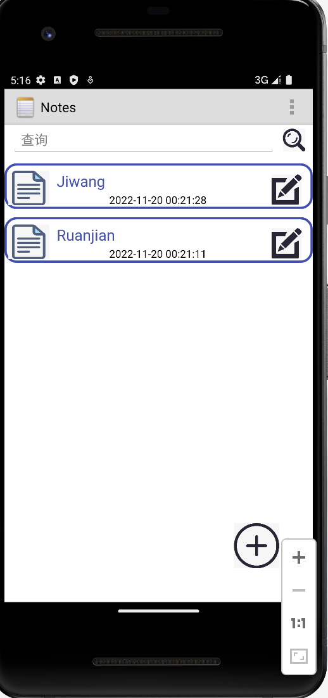
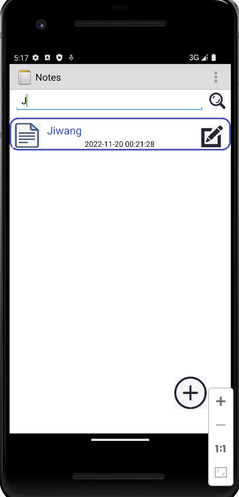
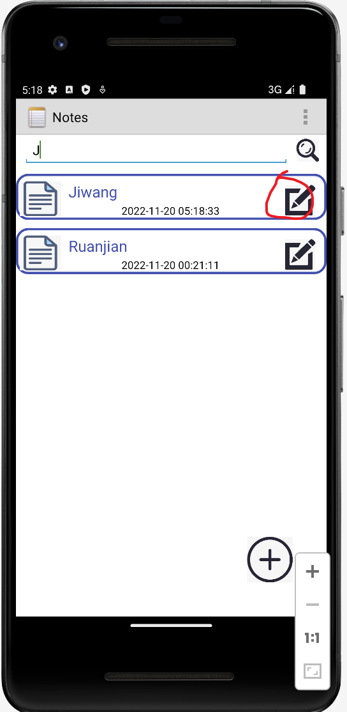
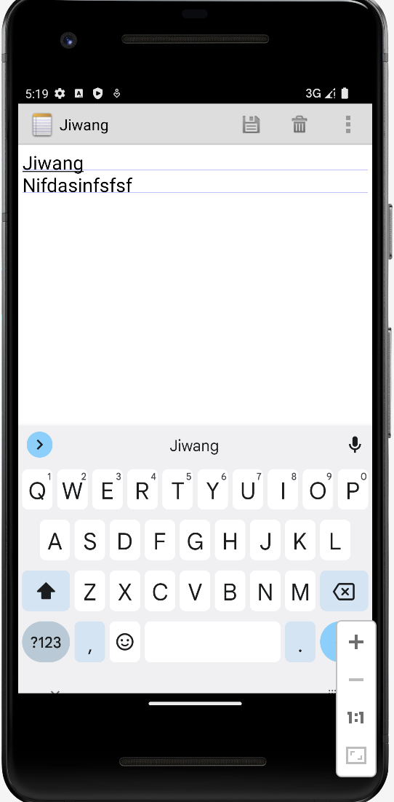
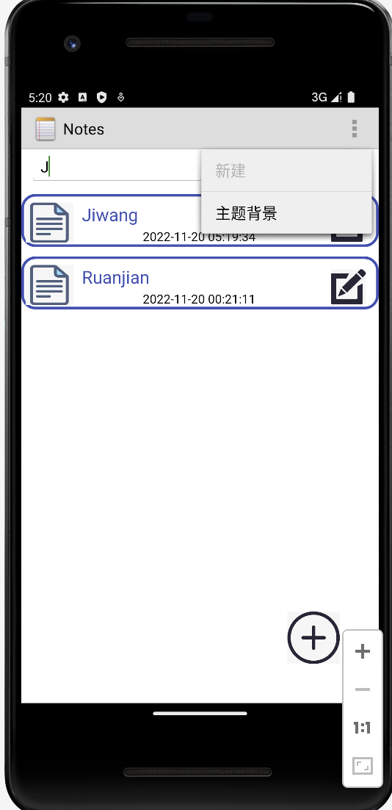
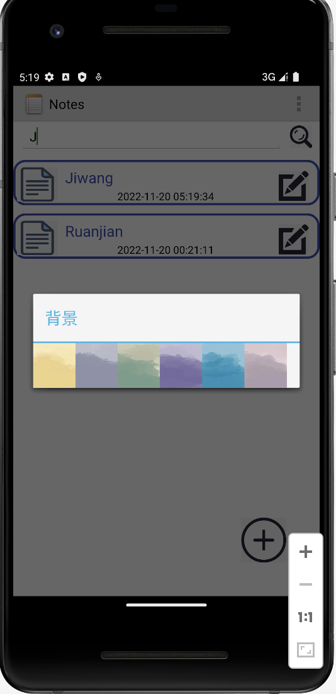
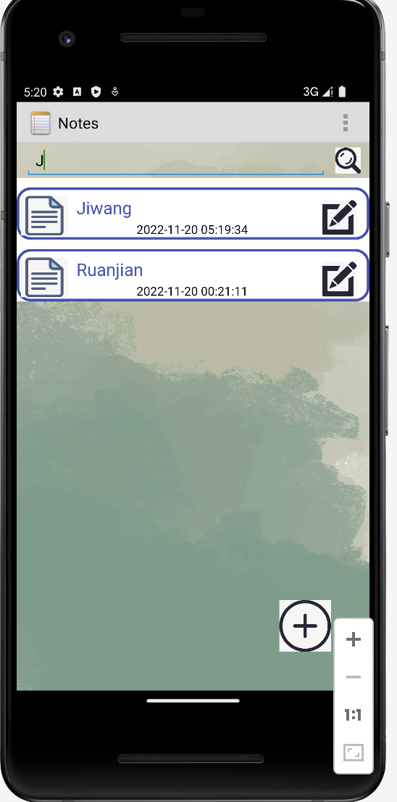

## # Notepad #

## 期中实验

一、NoteList显示时间戳

二、笔记查询

三、笔记编辑

四、更改背景

五、ui美化

### 一、NoteList显示时间戳

### 效果图：

### 关键代码：

	package com.example.android.notepad.util;
	
	import java.text.SimpleDateFormat;
	import java.util.Date;
	
	public class DateUtil {
	    public static String StringToDate(String str_data)
	    {
	        String beginDate=str_data;
	        SimpleDateFormat sdf=new SimpleDateFormat("yyyy-MM-dd HH:mm:ss");
	        String sd = sdf.format(new Date(Long.parseLong(beginDate)));
	        return  sd;
	    }
	}

### 二、笔记查询（根据标题查询）

### 效果图：

### 关键代码：

'''

	package com.example.android.notepad.bean;
	
	import android.database.Cursor;
	
	public class NoteBean {
	    private String Title;//笔记的标题
	    private String createTime;//笔记的创建时间
	    private String Cursor_id;//所属的游标的position
	
	    public NoteBean(String title, String createTime) {
	        Title = title;
	        this.createTime = createTime;
	    }
	
	    public NoteBean(String title, String createTime, String cursor_id) {
	        Title = title;
	        this.createTime = createTime;
	        Cursor_id = cursor_id;
	    }
	
	    public NoteBean(String title, String createTime, String cursor_id, Cursor cursor) {
	        Title = title;
	        this.createTime = createTime;
	        Cursor_id = cursor_id;
	    }
	
	    public String getTitle() {
	        return Title;
	    }
	
	    public void setTitle(String title) {
	        Title = title;
	    }
	
	    public String getCreateTime() {
	        return createTime;
	    }
	
	    public void setCreateTime(String createTime) {
	        this.createTime = createTime;
	    }
	
	    public String getCursor_id() {
	        return Cursor_id;
	    }
	
	    public void setCursor_id(String cursor_id) {
	        Cursor_id = cursor_id;
	    }
	}

### 三、笔记编辑

### 效果图：

### 关键代码：

	

	package com.example.android.notepad.util;

​	

	import android.content.Context;
	import android.content.SharedPreferences;
	import com.example.android.notepad.application.MyApplication;

​	
​	

	public class SharedPreferenceUtil {
	
	    private static String FILENAME = "Config";

​	

	    public static boolean CommitDate(String key, String date) {
	        SharedPreferences sp = MyApplication.getContext().getSharedPreferences(FILENAME, Context.MODE_PRIVATE);
	        SharedPreferences.Editor editor = sp.edit();
	        editor.putString(key, date);
	        return editor.commit();
	    }

​	

	    public static void ApplyDate(String key, String date) {
	        SharedPreferences sp = MyApplication.getContext().getSharedPreferences(FILENAME, Context.MODE_PRIVATE);
	        SharedPreferences.Editor editor = sp.edit();
	        editor.putString(key, date);
	        editor.apply();
	    }
	
	    /*
	    *获取数据
	     */
	    public static String getDate(String key) {
	        SharedPreferences sp = MyApplication.getContext().getSharedPreferences(FILENAME, Context.MODE_PRIVATE);
	        String str = sp.getString(key, "");
	        if (!str.isEmpty()) {
	            return str;
	        } else {
	            return null;
	        }
	    }
	

### 

#### 四、更改背景

### 效果图：

### 关键代码：

	package com.example.android.notepad.application;
	
	import android.app.Application;
	import android.content.Context;
	import android.util.Log;
	import com.example.android.notepad.util.SharedPreferenceUtil;
	
	public class MyApplication extends Application {
	
	    private static Context context;
	    private static String background="#ffffff";//背景颜色的十六进制值,默认为白色
	
	    @Override
	    public void onCreate() {
	        super.onCreate();
	        context=getApplicationContext();
	        readBackground();
	    }
	
	    public static Context getContext() {
	        return context;
	    }
	
	    public static void setContext(Context context) {
	        MyApplication.context = context;
	    }
	
	    public static String getBackground() {
	        return background;
	    }
	
	    public static void setBackground(String background) {
	        MyApplication.background = background;
	    }
	
	    /*
	        读取配置文件中的背景颜色
	         */
	    public static void readBackground(){
	        if(SharedPreferenceUtil.getDate("background")==null||SharedPreferenceUtil.getDate("background").equals("")){
	
	        }
	        else{
	            background= SharedPreferenceUtil.getDate("background");
	        }
	    }
	
	    /*读取配置文件中的背景颜色*/
	    public static void saveBackground(){
	        SharedPreferenceUtil.CommitDate("background",background);
	    }
	}

#### 五、ui美化

### 效果图：

### 关键代码：

'''

	@Override
	protected void onCreate(Bundle savedInstanceState) {
	    super.onCreate(savedInstanceState);
	
	    /*
	     * Creates an Intent to use when the Activity object's result is sent back to the
	     * caller.
	     */
	    final Intent intent = getIntent();
	
	    /*
	     *  Sets up for the edit, based on the action specified for the incoming Intent.
	     */
	
	    // Gets the action that triggered the intent filter for this Activity
	    final String action = intent.getAction();

        // For an edit action:
        if (Intent.ACTION_EDIT.equals(action)) {
    
            // Sets the Activity state to EDIT, and gets the URI for the data to be edited.
            mState = STATE_EDIT;
            mUri = intent.getData();
            Log.d("zzz","uri="+mUri);
            // For an insert or paste action:
        } else if (Intent.ACTION_INSERT.equals(action)
                || Intent.ACTION_PASTE.equals(action)) {
    
            // Sets the Activity state to INSERT, gets the general note URI, and inserts an
            // empty record in the provider
            mState = STATE_INSERT;
            mUri = getContentResolver().insert(intent.getData(), null);
    
            /*
             * If the attempt to insert the new note fails, shuts down this Activity. The
             * originating Activity receives back RESULT_CANCELED if it requested a result.
             * Logs that the insert failed.
             */
            if (mUri == null) {

                // Writes the log identifier, a message, and the URI that failed.
                Log.e(TAG, "Failed to insert new note into " + getIntent().getData());
                // Closes the activity.
                finish();
                return;
            }
    
            // Since the new entry was created, this sets the result to be returned
            // set the result to be returned.
            setResult(RESULT_OK, (new Intent()).setAction(mUri.toString()));
    
        // If the action was other than EDIT or INSERT:
        } else {
    
            // Logs an error that the action was not understood, finishes the Activity, and
            // returns RESULT_CANCELED to an originating Activity.
            Log.e(TAG, "Unknown action, exiting");
            finish();
            return;
        }

        mCursor = managedQuery(
            mUri,         // The URI that gets multiple notes from the provider.
            PROJECTION,   // A projection that returns the note ID and note content for each note.
            null,         // No "where" clause selection criteria.
            null,         // No "where" clause selection values.
            null          // Use the default sort order (modification date, descending)
        );
    
        // For a paste, initializes the data from clipboard.
        // (Must be done after mCursor is initialized.)
        if (Intent.ACTION_PASTE.equals(action)) {
            // Does the paste
            performPaste();
            // Switches the state to EDIT so the title can be modified.
            mState = STATE_EDIT;
        }
    
        // Sets the layout for this Activity. See res/layout/note_editor.xml
        setContentView(R.layout.note_editor);
    
        // Gets a handle to the EditText in the the layout.
        mText = (EditText) findViewById(R.id.note);
    
        /*
         * If this Activity had stopped previously, its state was written the ORIGINAL_CONTENT
         * location in the saved Instance state. This gets the state.
         */
        if (savedInstanceState != null) {
            mOriginalContent = savedInstanceState.getString(ORIGINAL_CONTENT);
        }
    }

'''
